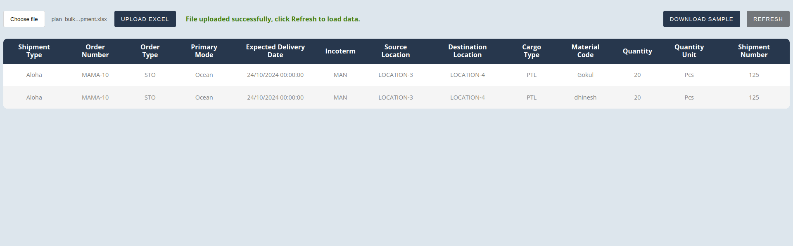

# Excel File Uploader

This is an Express.js and Vue.js application for bulk uploading shipment data from an Excel file.

## Features

- Upload Excel files containing shipment data.
- Process uploaded data and save shipments to the database.
- Refresh shipment data.
- Download a demo Excel file.

## Installation

1. Clone this repository.
2. Install dependencies for both the backend and frontend:

   ```bash
   npm install
   ```

3. Start the backend server on port `8000`:
   ```bash
   npm start
   ```
4. Start the frontend development server on port `5173`:
   ```bash
   npm run dev
   ```

Ensure that you have Node.js installed on your system before proceeding with the installation. These commands will set up the backend server on port `8000` and the frontend development server on port `5173`.

## Usage

1. Upload an Excel file containing shipment data.
2. Click "Upload Excel" to initiate the upload process.
3. Once uploaded successfully, click "Refresh" to load the data.
4. To download a demo Excel file, click "Download Sample".

## Running Tests

To run the unit tests for this application, follow these steps:

1. Ensure that all dependencies are installed by running:

   ```bash
   npm install
   ```

2. Execute the following command to run the tests:

   ```bash
   npm test
   ```

   This command will run the unit tests using Mocha and output the results to the console. You can use the `npm run testWithLogs` to log output if needed.

3. After the tests have finished running, you will see the test results displayed in the console, indicating whether each test passed or failed.

Make sure to resolve any dependencies or configuration issues before running the tests to ensure accurate results.

## Screenshots



## Technologies Used

- Vue.js
- Node.js
- Express.js
- MongoDB

## Further Improvements

- Implement global error handling to gracefully handle errors throughout the application.
- Enhance validation mechanisms to ensure data integrity and consistency.
- Implement additional security practices such as input sanitization, authentication, authorization, and data encryption to enhance application security.
- Enhance UI indicators to provide clearer feedback to users, improving the overall user experience and usability.
